# Reforcing Learning
Elementor comunes para tareas de control, como pueden ser el ajedees, un brazo mecanico o el pacman, pare realizar una tarea:  los elementos son:

## Estado
 
Toda informacion relevante que describe en que situacion esta 

## Acctiones
 
Acciones que son llevadas a cabo durante la tarea, las acciones se escojen en base al estado de la tarea

## Recompensa
 
UN valo numerico que el agente recibe luego de llevar a cabo una accion, determina el efecto inmediato de haber llevado a cabo esa accion

## Agente
La entidad que va a participar en la tarea, observando su **estado** y llevando a cabo **acciones** en cada momento del tiempo

## Entorno
Todos los aspectos de la tarea que el agente no conoce, 

# Procesos de desicion de Markov (MDP)
- Estados futuros dependen solo parcialmente de las acciones
- El proceso avanza en intervalos infinitos 
  
El agente, interactua con el entorno, observa el estado y ejecuta una accion, esa accion modifica el estado y recibe una recompensa del entorno, que le da una devolucion para saber si la accion fue buena o no 

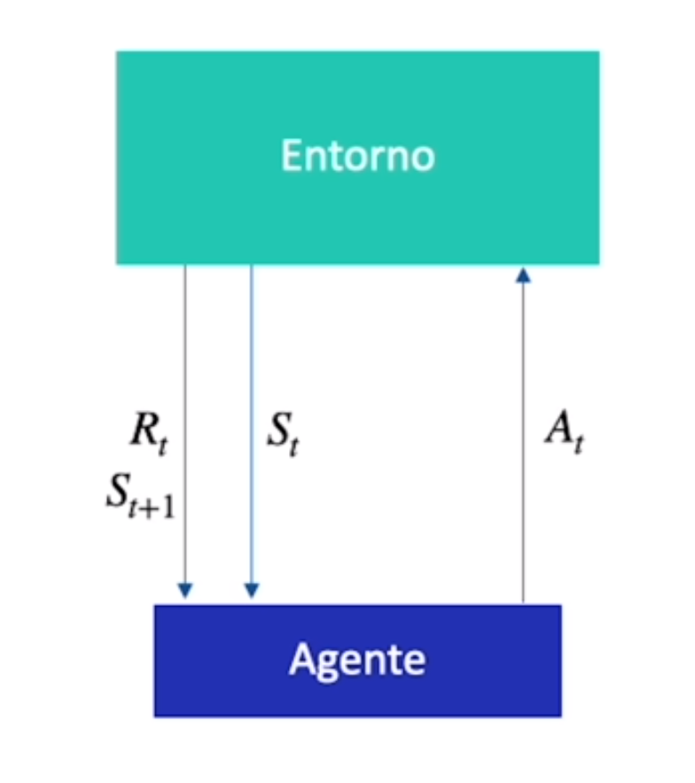

 
 

*Cuando esta en S1 el agente toma una accion, tiene el %10 de ir a la accion S0 y un %90 de volver a la S1*
 

 

Hay 2 tipos de procesos:
- finitos: acciones, estados y recompensas son finitas
- infinitos: una o mas de estas 3 variables son infinitos
 
Los procesos pueden ser:
- Episodicos: Termina bajo unas ciertas condiciones
- Continuos: No tiene una condicion para terminar, su ejecucion es infinita
 

## Trayectoria
Rastro que se genera cuando un agente se mueve 
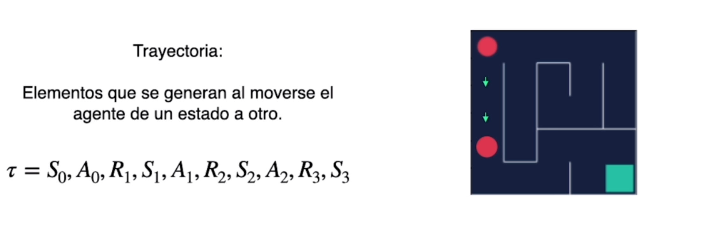 
 

## Episodio
Comienza en el estado inicial y termina en el estado final 
 
 

## Recompensa
Resultado inmediato que produce nuestras acciones 

## Retorno
Suma de recompensa que el agente obtiene, en el ajedrez si comemos una ficha podemos dejar descubierto al rey 

## Factor de descuento
Podemos multiplicar las recompensas por u factor de descuento (gama elevada a un momento del tiempo en que se consigue), de esa forma vamos a buscar el camino lo antes posible 
cuando gama es mas cerca a cero el agente va a tratar de llegar lo mas rapido posible 
 

## Politica de accion
Una funcion que decide que accion tomar 
 
 

- Determinista: siempre escoje la misma accion
- Estocastica: escoje una accion en base a unas determinadas probabilidades
 
Tenemos que hallar la politica optima, la vamos a llamar como pi*
 
 
q-valor, es el retorno que esperamos obtener si partiendo de ese estado tomamos la accion especificada 
 

## Ecuacion Bellman
Generamos una relacion recursiva entre su estado y los estados sucesores

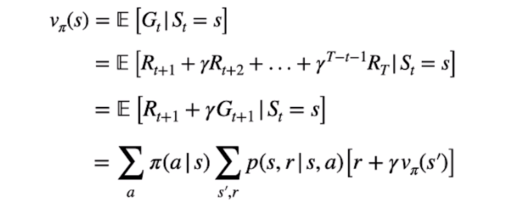 

# Librerias

## gym
nos proporciona una interface a las tareas de control que queremos resolver, tambien podemos realizar customizaciones como lo hicimos en el archivo *2022-03-Reinforcement-learning/beginner_master_rl/envs.py* (hicimos un laberinto)

# Programacion dinamica
Consiste en resolver los problemas mas pequeños para encontrar la politica mas oprima. 
La **solucion** optima a todos los **subproblemas** produce la solucion optima del problema **original** 

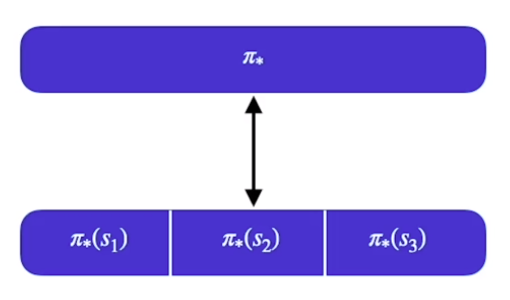 

POdemos encontrar la politica optima para cada estado, cuando tengamos todas podemos combinarlas para optener la politica optima 

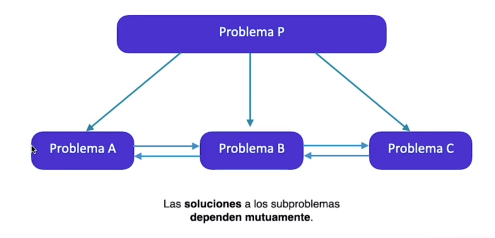 

Dependen mutuamente 

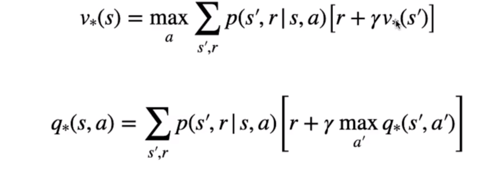 

Vamos a tener una tabla con una entrada para cada una de las entradas de valores que va a ir mejorando. 
Estado a la derecha por ejemplo 

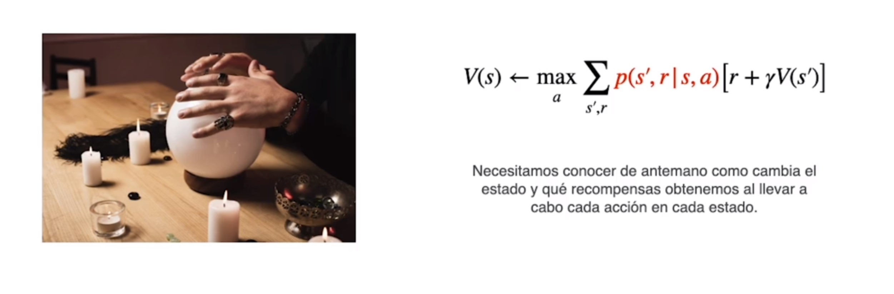 

Funciona solo cuando tenemos un modelo perfecto a la tarea que nos enfrentamos, todo lo que esperamos. 
Con un auto es diferente (por ejemplo), pueden pasar muchas cosas que no nos esperamos 
Resuelve problemas mediante valores esperados, no a base de ensayo y error 

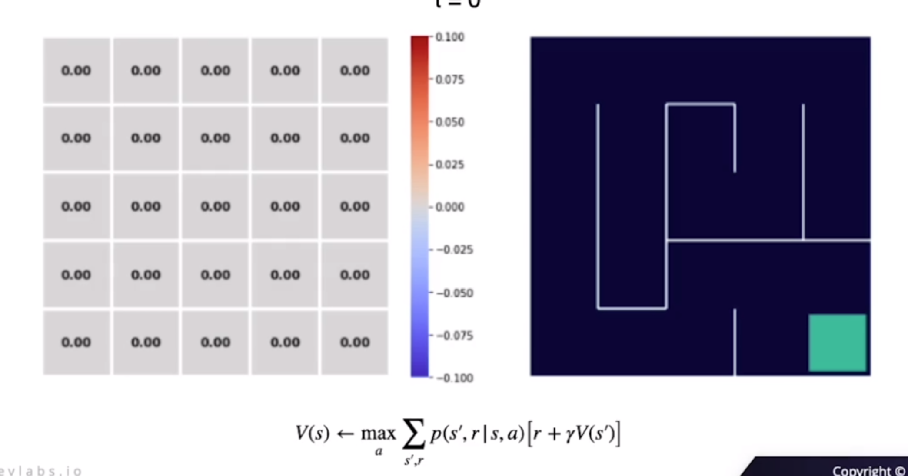 

Por cada paso recibe una recompensa de -1, tiene que encontrar la salida mas corta

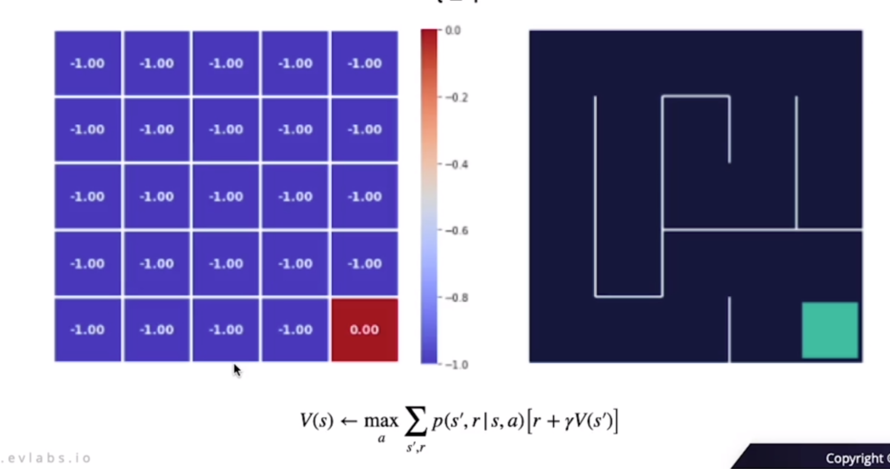 

siguiente interacion, siguen acercandose a sus valores optimos 

- r + g*V(s')
- -1 + (0.99 * 0)
- -1 + (0.99 * -1)
- -1 + (0.99 * -1.99)

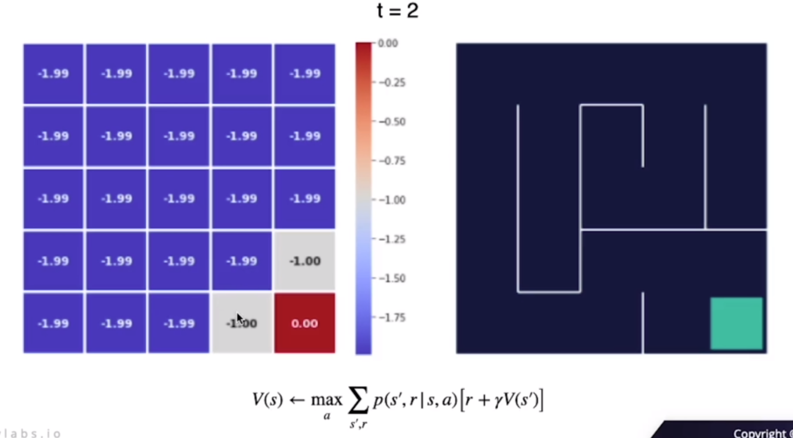 

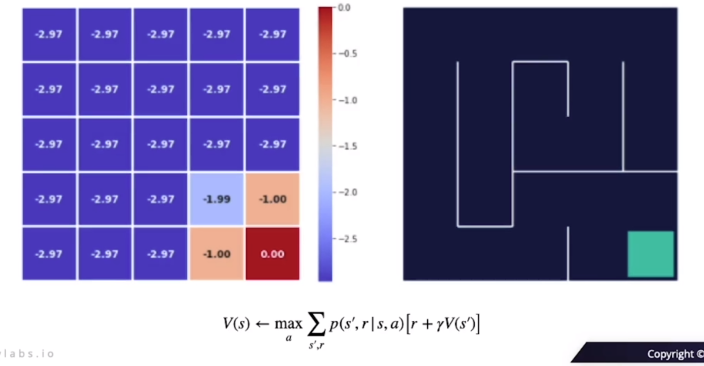 

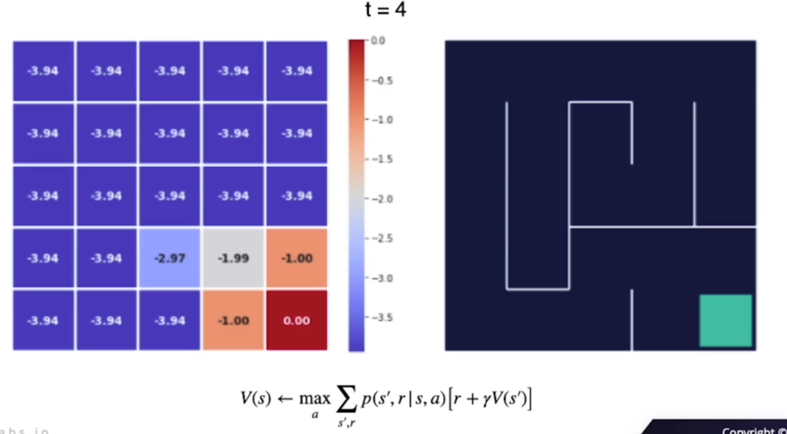 

 

## Iteracion de politica
Tanto la funcion valor, como la politica, se iran acercando al valor optimo

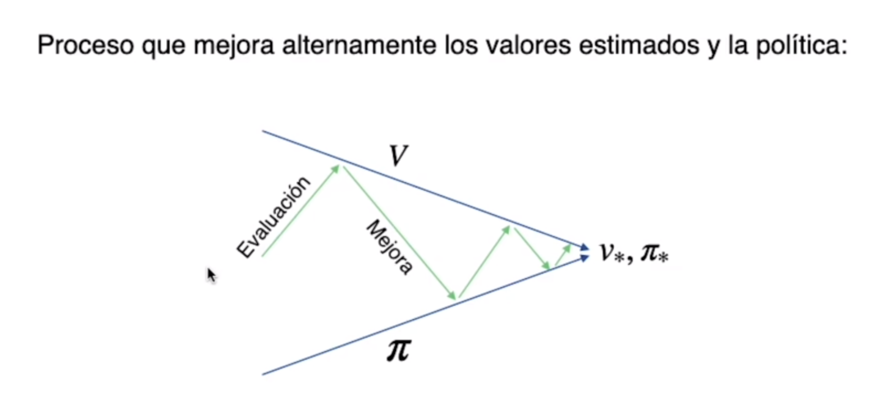 

